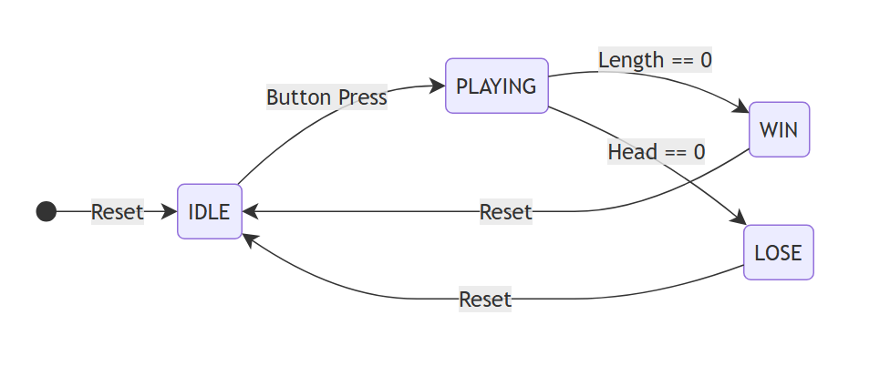
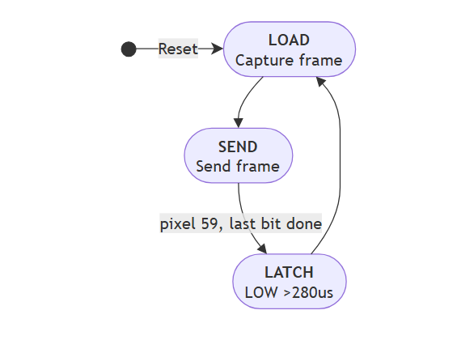

```
ARCHITECTURE.md
│
├── 1. Architecture Overview
├── 2. Clock & Timing Architecture
├── 3. Top-Level Module Architecture
├── 4. Input Subsystem
├── 5. Game Engine
├── 6. WS2812B LED Driver
├── 7. Module Interfaces & Integration
└── 8. Design Decisions
```

# Architecture

## 1. Architecture Overview

### 1.1. High-Level Architecture & Data Flow

The FPGA-based Snake game follows a strict feed-forward data path from physical input to physical output. The system consists of four main functional blocks:
- **Button Conditioner:** Synchronizes and debounces raw physical inputs.
- **Tick Generator:** Provides timing events (clock-enables) for game logic.
- **Game Engine:** Consumes events to update the game state and generates logical pixel data.
- **WS2812B Driver:** Serializes the logical pixel array into the required physical waveform.

The following diagram illustrates the overall system architecture, showing the hardware boundaries of the FPGA and the strict one-way data flow of the internal RTL modules:

```text
                              +-------------------------------------------------------------+
                              |                     FPGA (Cyclone II)                       |
                              |                                                             |
+------------------+          |  +--------------+         +--------------+                  |
|    DE2 Board     |          |  |              | events  |              |                  |
|  4x Pushbuttons  |--KEYs--->|--| Input        |-------->| Game Engine  |                  |
|                  |          |  | Synchronizer | (1-tick)| (Core Logic) |                  |
+------------------+          |  | & Debouncer  |         |              |  Pixel Array     |
                              |  +--------------+         | - FSM        |  (60 x 3-bit)    |
+------------------+          |                           | - Snake/     |=========+        |
|    DE2 Board     |          |                           |   Bullet pos |         |        |
|   Toggle Switch  |--SW[17]->|-------------------------->| - Collision  |         v        |
| (Global Reset)   |          |      (Async Reset)        |              |  +-------------+ |  Serial   +---------------+
+------------------+          |                           +------^-------+  | WS2812B     | |  PWM      | External      |
                              |                                  |          | Driver      |-+--GPIO---->| LED Strip     |
+------------------+          |  +--------------+  tick enables  |          | (Physical)  | |           | (60 Pixels)   |
|    DE2 Board     |          |  | Tick         |----------------+          +------^------+ |           +---------------+
|   50 MHz Clock   |--Clock-->|--| Generator    |                                  |        |
|   Oscillator     |          |  | (Timebase)   |----------------------------------+        |
+------------------+          |  +--------------+            (50 MHz)                       |
                              |                                                             |
                              +-------------------------------------------------------------+
```

### 1.2. Major RTL Modules and Responsibilities

The hardware design is decoupled into four primary RTL modules:

*   **Button Conditioner:** 

The Button Conditioner interfaces directly with the DE2 board's active-low pushbuttons.

Its responsibilities are:
- Synchronize physical asynchronous button inputs to the 50 MHz master clock domain using a 2-stage flip-flop synchronizer.
- Perform edge detection to generate a single one-clock-cycle pulse (button event) for each valid press.
- Provide clean, synchronized control events to the Game Engine.

The module isolates the Game Engine from the electrical behavior of the physical pushbuttons.

---
*   **Tick Generator (Timebase Controller):** 

The Tick Generator receives the 50 MHz master clock and generates synchronous clock-enable pulses for game timing.

Its responsibilities are:
- Maintain timing counters based on the 50 MHz system clock.
- Generate a 50 ms tick for bullet movement.
- Generate a 250 ms tick for snake movement.
- Provide timing events to the Game Engine without creating a separate game clock domain.

The Game Engine therefore remains synchronous to the 50 MHz master clock while updating the game state at human-perceptible speeds.

---
*   **Game Engine (Core FSM & Datapath):** 

The Game Engine is the core logic block of the Snake game.

It manages the overall game state, including:
- `IDLE`: Initial or waiting state before gameplay begins.
- `PLAYING`: Normal gameplay in which the snake moves and bullets can be fired.
- `WIN`: Terminal state reached when the win condition is satisfied.
- `LOSE`: Terminal state reached when the lose condition is satisfied.

During the `PLAYING` state, the Game Engine:
- Tracks the snake position and state.
- Tracks the bullet position, color, and state.
- Processes button events to create bullets.
- Updates the snake and bullet positions according to the corresponding game ticks.
- Performs collision detection.
- Determines whether a collision results in a successful hit or a miss.
- Updates the logical color data representing the LED strip.

The Game Engine is responsible for the game's behavior but does not directly generate the physical WS2812B waveform.

---
*   **WS2812B Driver (Physical Interface):** 

The WS2812B Driver provides the physical interface between the Game Engine and the LED strip.

Its responsibilities are:
- Receive the logical pixel/color data generated by the Game Engine.
- Serialize the pixel data into the bit stream required by the WS2812B interface.
- Generate the timing-sensitive waveform required by the WS2812B protocol.
- Drive the FPGA output connected to the LED strip.

The driver operates from the 50 MHz master clock and is independent of the slower game ticks.

This separation allows the Game Engine to work with abstract pixel/color data while the WS2812B Driver handles the physical communication protocol.

---

### 1.3. Clock, Reset, and Control Signal Flow

The design adheres to strictly synchronous design practices, utilizing a single 50 MHz clock domain and 1-clock-cycle enable pulses to control low-frequency events.

```text
[External Inputs]
       │
       ├── rst_sw (Global Async Reset) ────────► (Routed to ALL modules)
       │
       └── clk_50m (50 MHz Master Clock) ──────► (Routed to ALL modules)
               │
               │                   [Control Pulses Flow]
               │
               ├─► [Button Conditioner] ─── btn_event[3:0] ───┐
               │                                              ▼
               ├─► [Tick Generator] ──── bullet_tick ────► [Game Engine]
               │                      └─ snake_tick  ────►
               │
               ├─► [Game Engine]
               │
               └─► [WS2812B Driver]
```

* Master Clock (`clk_50m`): The 50 MHz hardware clock routes in parallel to all synchronous elements in the system. No derived clocks or PLLs are used.

* Global Reset (`rst_sw`): The active-high asynchronous reset is distributed to all modules, forcing every FSM and counter back to its initial safe state (`IDLE`, `LOAD`, length=5, etc.).

* Control Pulses (Event-Driven Execution):

   * The `button_conditioner` generates `btn_event[3:0]`.

   * The `tick_generator` outputs `bullet_tick` (50 ms) and `snake_tick` (250 ms).

   * These signals are strictly 1-clock-cycle active-high pulses. The `game_engine` evaluates movement, firing, and collision logic only when these specific pulses assert, ensuring timing stability and preventing race conditions without crossing clock domains.
   
## 2. Clock & Timing Architecture

### 2.1 Master Clock
- Source: DE2 onboard oscillator
- Frequency: 50 MHz
- Period: 20 ns

### 2.2 Game Timing
- The design uses a single 50 MHz clock domain.
- Clock-enable pulses are used.
- `bullet_tick`: 50 ms (2,500,000 clock cycles).
- `snake_tick`: 250 ms (12,500,000 clock cycles).

### 2.3 Module Clocking & Reset
- All RTL modules operate synchronously from the 50 MHz master clock.
- Reset initializes the timing counters and game state.

### 2.4 WS2812B Timing
- WS2812B waveform timing is generated directly from the 50 MHz clock.
- Each protocol timing interval is implemented using integer clock-cycle counts.
- Detailed waveform timing and cycle counts are defined in the WS2812B Driver section.

---

## 3. Top-Level Module Architecture

### 3.1. Module Definition and I/O
* **Top-Level Name:** `top_snake_game`
* **External Inputs:**
  * `clk_50m`: 50 MHz Master Clock (from `PIN_N2`).
  * `rst`: Global asynchronous reset (from `SW[17]`).
  * `btn_in[3:0]`: Raw, active-low pushbutton inputs (from `KEY[3:0]`).
* **External Outputs:**
  * `led_data_out`: Single-wire serial PWM output (to `GPIO_0[0]`).

### 3.2. Internal Instantiations and Signal Flow
The top-level module acts as a structural wrapper instantiating four internal modules:

1. **`tick_generator`**: 
   * Receives the 50 MHz clock. 
   * Outputs stable clock-enable pulses (`tick_50ms`, `tick_250ms`) to the game engine.
2. **`button_conditioner`**: 
   * Receives the raw `btn_in[3:0]` from the physical keys. 
   * Synchronizes and debounces them, passing clean 1-clock-cycle `btn_event[3:0]` pulses to the game engine.
3. **`game_engine`**: 
   * Driven by the clock, reset, tick signals, and button events. 
   * Outputs a continuous 60-element logical array (e.g., `pixel_data[0:LED_COUNT-1][2:0]`).
4. **`ws2812b_driver`**: 
   * Reads the `pixel_data` array from the game engine. 
   * Connects its serial output directly to the top-level `led_data_out` port.

### 3.3. Clock and Reset Distribution
* **Clock Network:** The master `clk_50m` is routed directly in parallel to all four instantiated sub-modules. No derived clocks are used.
* **Reset Network:** The global `rst` signal routes to all modules, ensuring synchronous or asynchronous initialization of all state machines and counters to a known IDLE state.


---

## 4. Input Subsystem

### 4.1. Push-Button Electrical Behavior

The DE2 push-buttons `KEY[3:0]` are active-low inputs:

- Logic `1`: button released
- Logic `0`: button pressed
- The push-buttons are hardware-debounced on the DE2 board.

Therefore, no additional mechanical debounce circuit is required in the FPGA RTL.

### 4.2. Input Conditioning

The raw button signals are treated as asynchronous inputs to the 50 MHz FPGA clock domain.

Each button passes through a 2-flip-flop synchronizer before being processed by edge detection.

The input path is:

```text
Physical KEY
    ↓
DE2 Hardware Debounce
    ↓
2-FF Synchronizer
    ↓
Edge Detection
    ↓
btn_event[3:0]
    ↓
Game Engine
```

The edge detector generates a single-clock-cycle event when a valid button press is detected.

### 4.3. Game Engine Interface

The input subsystem provides a 4-bit event bus to the Game Engine: `btn_event[3:0]`.

* **Event Representation:** Each bit corresponds to a distinct button press event.
* **Timing Behavior:** A value of `1` indicates that the corresponding physical button has been newly pressed (synchronized and edge-detected) during the current clock cycle. Otherwise, the value remains `0`.
* **Consumer:** The Game Engine consumes these 1-clock-cycle pulses to trigger the creation of bullets.

### 4.4. Button-to-Color Mapping
| Button | Pressed level | Event signal | Bullet color |
| --- | --- | --- | --- |
| `KEY[0]` | `0` | `btn_event[0]` | Red |
| `KEY[1]` | `0` | `btn_event[1]` | Green |
| `KEY[2]` | `0` | `btn_event[2]` | Blue |
| `KEY[3]` | `0` | `btn_event[3]` | Yellow |

`btn_event` is active high.  A simultaneous event on more than one button
fires one bullet only, using this fixed priority: 
- Red (`KEY[0]`), Green
(`KEY[1]`), Blue (`KEY[2]`), then Yellow (`KEY[3]`).

---

## 5. Game Engine

### 5.1. Responsibilities and Scope

The Game Engine is the central logic block of the Snake game. It maintains the game state and updates the snake, bullet, collision, and game progression based on button events and game timing signals.

Its responsibilities include:

* Managing the game states: `IDLE`, `PLAYING`, `WIN`, and `LOSE`.
* Managing the snake state, including its position, length, and segment colors.
* Managing the single active bullet, including its position, color, and active status.
* Updating snake and bullet movement according to the corresponding timing ticks.
* Detecting and resolving bullet–snake head collisions.
* Updating the snake and bullet state after a collision.
* Determining the WIN and LOSE conditions.
* Generating the current logical LED pixel data for the 60-pixel LED strip.

The Game Engine does not handle physical button conditioning or WS2812B waveform generation. It receives clean button events from the Input Subsystem and provides logical pixel data to the WS2812B Driver.

---

### 5.2. Game States

The Game Engine uses a four-state FSM to control the overall game flow.

| State     | Description                                                                                                             |
| --------- | ----------------------------------------------------------------------------------------------------------------------- |
| `IDLE`    | The game is waiting for a start condition. The game data is initialized or held at its initial state.                   |
| `PLAYING` | The game is active. Snake and bullet movement, collision detection, and game-state updates are performed in this state. |
| `WIN`     | The player has successfully completed the game. Gameplay updates are stopped.                                           |
| `LOSE`    | The player has lost the game. Gameplay updates are stopped.                                                             |

The high-level state transitions are:



The detailed conditions for `WIN` and `LOSE`, as well as the game data maintained in each state, are defined in the corresponding game-rule and data-representation sections.

---

### 5.3. Snake and Bullet Representation

The Game Engine represents the snake and bullet using simple state variables aligned with the one-dimensional LED strip.

#### Snake

The snake is modeled as a contiguous block within a 1D array of size `LED_COUNT` (default 60), where each index directly maps to a physical LED position.

* **Color Encoding:** Each element stores a 3-bit logical color code:
  * `3'b000` = EMPTY / OFF
  * `3'b001` = RED
  * `3'b010` = GREEN
  * `3'b011` = BLUE
  * `3'b100` = YELLOW

* **Movement & Alignment:** The snake travels from higher LED indices down toward LED 0. The snake's "head" is always located at the leading (lowest) index of its body.

* **Reset Configuration:** Upon reset, the snake initializes at the far end of the LED strip. 
  * `snake_length` initializes to `DEFAULT_SNAKE_LENGTH` (default 5).
  * `head_position` initializes to `LED_COUNT - DEFAULT_SNAKE_LENGTH` (default 55).
  * The initial segments are populated with a fixed color sequence:

| LED Index | 55 (Head) | 56 | 57 | 58 | 59 (Tail) |
| :--- | :--- | :--- | :--- | :--- | :--- |
| **Color** | RED | GREEN | BLUE | YELLOW | RED |
#### Bullet

Only one bullet may be active at a time.

The bullet state consists of:

* `bullet_position`: current LED position, initially 0 when fired.
* `bullet_color`: determined by the button used to fire the bullet.
* `bullet_active`: indicates whether a bullet is currently in flight.

The bullet travels from LED 0 toward LED 59 and interacts with the snake's head when they meet.

---

### 5.4. Game Update Behavior

#### Snake Movement
* The snake moves toward LED 0 by one LED position on each `snake_tick`. The snake remains stationary between `snake_ticks`.

#### Bullet Movement
* Only one bullet may be active at a time. When fired, the bullet starts at LED 0 and moves toward LED 59 by one LED position on each `bullet_tick`.

* The bullet becomes **inactive** when a collision is resolved.

#### Update Ordering and Look-Ahead

Each `PLAYING` update is calculated combinationally from the registered game state and committed synchronously on the next rising clock edge. The RTL avoids derived clocks, relying instead on combinational look-ahead signals (`next_head`, `next_bullet`, `next_length`, `next_active`, `next_color`).

To prevent race conditions and ensure deterministic behavior, the combinational logic evaluates in the following strict priority sequence:

1. **State Initialization:** 
   Begin with the currently registered snake and bullet states.

2. **Movement Proposals (Tick Evaluation):** 
   * If `bullet_tick` asserts: Propose a 1-LED increase in the active bullet position.
   * If `snake_tick` asserts: Propose a 1-LED decrease in the snake head position.
   * *Note: If both ticks assert in the same cycle, both proposals are calculated before evaluating collisions.*

3. **Collision Detection (Anti-Tunneling):** 
   Detect collisions using the *proposed* positions. A hit is registered if `next_bullet >= next_head`. Using a greater-than-or-equal check (rather than strict equality) guarantees that simultaneous movements cannot cause the bullet to cross paths and "tunnel" through the snake undetected.

4. **Collision Resolution:** 
   Upon a valid collision, the bullet is immediately consumed. The game then compares the bullet's color against the snake's *prospective* head segment:
   * **Match:** The segment is removed (`next_length` decreases by 1).
   * **Mismatch:** The snake retains its current segments and length.

5. **Terminal State Evaluation (WIN/LOSE):** 
   Assess the game status based on the completed look-ahead state:
   * **WIN:** `next_length == 0` (all segments cleared).
   * **LOSE:** `next_head == 0` (snake reached the end of the LED array).
   * *Note: Terminal states take effect on the current commit, overriding and suppressing any further gameplay updates.*

6. **Bullet Spawning (Fire):** 
   If the resolved state remains `PLAYING`, a button event can create a new bullet at `LED 0`. 
   * This is strictly permitted **only if no bullet was active at the start of the update**. 
   * A newly created bullet does not move or collide during the cycle it is spawned. 
   * Any button event occurring concurrently with a collision resolution or a terminal state entry is ignored.

This execution order ensures that collisions, end-of-strip boundary conditions, firing events, and terminal transitions remain unambiguous. Most importantly, collision resolution inherently holds priority over end-of-strip retirement when both could theoretically apply.

#### Initialization and Reset
After power-up or reset, the game enters the `IDLE` state with the initial snake configuration. While in `IDLE`, the snake does not move and button presses do not fire bullets. The first valid button press starts the game and transitions the FSM from `IDLE` to `PLAYING`.

---

### 5.5. WIN / LOSE Conditions

The Game Engine determines the end of the game using the following conditions:

* **WIN:** The snake length reaches `0`, meaning all snake segments have been removed.
* **LOSE:** The snake head reaches LED position `0`.

When either condition is satisfied, the Game Engine transitions from `PLAYING` to the corresponding terminal state. No further snake or bullet movement is performed while in `WIN` or `LOSE`.

---
### 5.6. LED Pixel Output

The Game Engine maintains a logical 60-pixel LED frame. Each pixel is represented internally using a 3-bit color code:

- `000`: OFF
- `001`: RED
- `010`: GREEN
- `011`: BLUE
- `100`: YELLOW

The pixel frame directly represents the current visual state of the LED strip. The Game Engine updates this data according to the current snake, bullet, collision, and game state.

The WS2812B Driver consumes this logical pixel data and converts each color code into the required 24-bit GRB representation before serializing it into the WS2812B waveform.

The Game Engine is therefore independent of the WS2812B physical timing and transmission protocol.

### 5.7. Terminal Display Behavior

On entry to a terminal state, gameplay is frozen and no bullet is displayed.
The complete 60-pixel frame is rendered as follows:

| State | Pixel values |
| --- | --- |
| `WIN` | All pixels GREEN |
| `LOSE` | All pixels RED |

This terminal frame applies to every LED index, 0 through 59 inclusive.

## 6. WS2812B LED Driver
### 6.1. Responsibilities and Interface

The WS2812B Driver receives the logical pixel data generated by the Game Engine and converts each pixel into the required 24-bit GRB representation. The pixel data is serialized MSB-first and transmitted using the timing-specific single-wire waveform required by the WS2812B protocol.


The Game Engine is responsible for determining the logical color of each LED, while the WS2812B Driver is responsible for converting this logical data into the physical LED communication waveform. This separation keeps the game logic independent of the WS2812B physical interface.

---

### 6.2. Pixel Data Format and Serialization

The system separates internal color logic from hardware transmission. The **WS2812B Driver** handles the conversion between these two domains.

#### Internal Representation (Game Engine)
Each LED uses a **3-bit logical color code**:
- `000` : OFF
- `001` : RED
- `010` : GREEN
- `011` : BLUE
- `100` : YELLOW

#### Hardware Format (WS2812B)
Each pixel requires **24-bit** data, transmitted in **GRB order** (Most Significant Bit first):
```text
[Green: G7...G0]  [Red: R7...R0]  [Blue: B7...B0]
```

#### 3-Bit Logical Color to 24-Bit GRB Mapping

The WS2812B Driver converts each 3-bit logical color code from the Game Engine into a fixed 24-bit GRB value.

The active color channels use an intensity value of `8'h3F` (approximately 25% of the 8-bit range). This value is an implementation choice for the project.

| 3-bit code | Logical color | Green byte | Red byte | Blue byte | 24-bit GRB value |
|------------|---------------|------------|----------|-----------|------------------|
| `3'b000` | OFF / EMPTY | `8'h00` | `8'h00` | `8'h00` | `24'h00_00_00` |
| `3'b001` | RED | `8'h00` | `8'h3F` | `8'h00` | `24'h00_3F_00` |
| `3'b010` | GREEN | `8'h3F` | `8'h00` | `8'h00` | `24'h3F_00_00` |
| `3'b011` | BLUE | `8'h00` | `8'h00` | `8'h3F` | `24'h00_00_3F` |
| `3'b100` | YELLOW | `8'h3F` | `8'h3F` | `8'h00` | `24'h3F_3F_00` |

`YELLOW` is generated by driving both the green and red channels with `8'h3F` while keeping the blue channel at `8'h00`.

#### Transmission Protocol
Data is sent sequentially down the LED chain from first to last.
- **Data Routing:** The first WS2812B latches the first 24 bits it receives. The remaining data is reshaped and forwarded via its `DO` (Data Out) pin to the next pixel.
- **Driver Tracking:** The hardware driver maintains synchronization using two counters:
  - **Pixel Counter:** Tracks the current LED being updated in the chain.
  - **Bit Counter:** Tracks the current bit (0-23) within the active pixel's data block.
### 6.3. Waveform Timing

The WS2812B-2020 uses a single-wire NZR communication protocol. Each data bit is encoded by the duration of the HIGH and LOW portions of the waveform. The timing requirements are defined by the device datasheet. [^1]

### 6.3.1. Logical Bit Waveforms

A logical `0` is represented by a shorter HIGH period followed by a longer LOW period.


A logical 1 is represented by a longer HIGH period followed by a shorter LOW period.


The T1H, T1L, T0H, and T0L timing parameters are listed in the following table:

| Parameter | Description | Timing |
| --- | --- | --- |
| T0H | 0 code, high voltage time | 220 ns - 380 ns |
| T1H | 1 code, high voltage time | 580 ns - 1 µs |
| T0L | 0 code, low voltage time | 580 ns - 1 µs |
| T1L | 1 code, low voltage time | 220 ns - 420 ns |
### 6.3.2. 50 MHz Clock Conversion

The FPGA master clock is 50 MHz:
```
Tclk = 1 / 50 MHz = 20 ns
```
Therefore, the datasheet timing ranges correspond approximately to:

| Timing | Datasheet Range | Equivalent Clock Cycles |
| ------ | --------------- | ----------------------- |
| `T0H`  | 220–380 ns      | 11–19 cycles            |
| `T0L`  | 580–1000 ns     | 29–50 cycles            |
| `T1H`  | 580–1000 ns     | 29–50 cycles            |
| `T1L`  | 220–420 ns      | 11–21 cycles            |


The final integer cycle counts used by the RTL implementation will be selected within these valid ranges.

### 6.3.3. Frame Latch / Reset

After all pixel data has been transmitted, the data line must remain `LOW` for more than `280 µs` to latch the transmitted frame.
```
DATA
───────────────────────────────────────────┐
                                           │
                                           └────────────────────────
                                           <────── RES > 280 µs ───>
```
At 50 MHz:
```
280 µs / 20 ns = 14,000 clock cycles
```
The driver will therefore generate a LOW period of at least `14,000` clock cycles between frames.

---


## 6.4. WS2812B Driver FSM

The WS2812B Driver is controlled by a finite state machine (FSM) that manages frame capture, pixel serialization, waveform generation, and the latch period.

### 6.4.1. FSM States

The driver uses four major states:

| State | Responsibility |
|-------|----------------|
| `LOAD` | Captures the current 60-pixel frame from the `game_engine` into the driver's transmission buffer. |
| `SEND` | Serializes the captured frame pixel-by-pixel and bit-by-bit while generating the required WS2812B waveform. |
| `LATCH` | Holds the data output LOW for more than 280 µs so the transmitted frame is latched by the LED strip. |

### 6.4.2. State Transitions


The driver follows the sequence:
```
reset → LOAD → SEND → LATCH → LOAD → ...
```
- `LOAD`: Capture a complete copy of the latest pixel frame.
- `SEND`: Serialize the captured frame from pixel 0 through pixel 59.
- `LATCH`: Hold `led_data_out` LOW for more than 280 µs.

The driver transitions from `SEND` to `LATCH` after the last bit (B0) of pixel 59 has been transmitted. After the latch period is complete, the driver returns to `LOAD` and captures the latest available pixel frame for the next transmission.
The high-level FSM flow is:



### 6.4.3. Frame Capture

- When entering `LOAD`, the driver captures a complete copy of the current pixel frame from the `game_engine`.

- The captured frame is stored in an internal transmission buffer and remains unchanged throughout the `SEND` state.

- This prevents changes in `game_engine` state during transmission from modifying the frame currently being sent.

### 6.4.4. Data Transmission

- In the `SEND` state, the driver transmits the captured frame sequentially:
```
Pixel 0 → Pixel 1 → ... → Pixel 59
```
- For each pixel, all `24 bits` are transmitted in `GRB` order and `MSB-first`.

- The driver uses:

  - `pixel_counter` to identify the current pixel.
  - `bit_counter` to identify the current bit within the 24-bit pixel data.
  - A timing counter to generate the HIGH and LOW durations required for the current logical bit.

- After the final bit of pixel 59 has been transmitted, the driver transitions to `LATCH`.

### 6.4.5. Latch and Frame Restart

During `LATCH`, `led_data_out` is held LOW for more than 280 µs.

After the latch period is complete, the driver returns to `LOAD` and begins the next frame transmission by capturing the latest available pixel data.

The Game Engine is not reset or affected by the LED driver's latch operation.

## 7. Module Interfaces & Integration
### 7.1. RTL Module Hierarchy
The system uses a strictly flattened hierarchy under the top-level wrapper, avoiding deep nesting to simplify signal tracing and timing analysis.

```text
top_snake_game
 ├── tick_generator
 ├── button_conditioner
 ├── game_engine
 └── ws2812b_driver
 ```
### 7.2. Inter-Module Signal Definitions

| **Signal Name** | **Width** | **Type** | **Source (Driver)**  | **Destination (Receiver)** | **Description / Timing Behavior**                                                                                                                                          |
| --------------- | --------- | -------- | -------------------- | -------------------------- | -------------------------------------------------------------------------------------------------------------------------------------------------------------------------- |
| `clk_50m`       | 1         | Clock    | DE2 Board            | All Modules                | 50 MHz Master Clock. Continuous square wave.                                                                                                                               |
| `rst_sw`        | 1         | Level    | DE2 Board            | All Modules                | Global asynchronous reset (active-high).                                                                                                                                   |
| `btn_event`     | 4         | Pulse    | `button_conditioner` | `game_engine`              | Synchronized, debounced button press events. Pulses HIGH for exactly 1 clock cycle upon falling edge of physical key.                                                      |
| `bullet_tick`   | 1         | Pulse    | `tick_generator`     | `game_engine`              | Timebase enable for bullet movement. Pulses HIGH for 1 clock cycle every 50 ms.                                                                                            |
| `snake_tick`    | 1         | Pulse    | `tick_generator`     | `game_engine`              | Timebase enable for snake movement. Pulses HIGH for 1 clock cycle every 250 ms.                                                                                            |
| `pixel_data`    | Array     | Data Bus | `game_engine`        | `ws2812b_driver`           | 2D Array `[0:LED_COUNT-1][2:0]` defining the 3-bit logical color of every pixel. Continuously driven combinationally by the game engine.                               |

### 7.3. Integration Characteristics
* Clock & Reset Distribution: `clk_50m` and `rst_sw` are routed directly to all submodules as a parallel bus. No module derives its own clock.

* Control vs. Data Flow:

   * The control flow is purely event-driven using 1-clock-cycle pulses (`btn_event`, `bullet_tick`, `snake_tick`).

   * The data flow (`pixel_data`) is continuous, allowing the `ws2812b_driver` to capture a static snapshot of the array at the exact moment it transitions into its `LOAD` state, decoupling transmission timing from game state updates.
## 8. Design Decisions

This section records the key architectural and RTL implementation decisions made for the Game Engine, focusing on hardware optimization, timing stability, and robust edge-case handling.

### 8.1. Two-Phase Look-Ahead Datapath (Race Condition Prevention)
* **Decision:** The Game Engine evaluates movement and collision using a two-phase "look-ahead" architecture. A combinational block calculates proposed future positions (`next_head`, `next_bullet`), and a sequential block commits these states synchronously.
* **Rationale:** Game ticks (`snake_tick` and `bullet_tick`) can assert in the same clock cycle. If evaluated sequentially within a single FSM block, a race condition occurs where one entity moves before the other, potentially missing collisions. The look-ahead approach guarantees that both entities' prospective positions are evaluated simultaneously before any collision logic is applied.

### 8.2. Snake Movement via Shift Register (Hardware Optimization)
* **Decision:** Snake movement is implemented by shifting the entire 60-element `snake_array` by one index at each `snake_tick`, rather than dynamically tracking head and tail pointers.
* **Rationale:** In RTL design, dynamically indexing an array (e.g., `snake_array[head_position + i]`) infers massive and complex multiplexer trees, consuming excessive logic elements. Shifting the entire array maps directly to native shift-register hardware in the FPGA, yielding a highly optimized, resource-efficient, and timing-friendly synthesized circuit.

### 8.3. Anti-Tunneling Collision Logic
* **Decision:** Collision detection is evaluated using a greater-than-or-equal condition (`next_bullet >= next_head`) rather than a strict equality check (`==`).
* **Rationale:** If the bullet and snake are adjacent and both movement ticks assert simultaneously, their updated positions will swap (the bullet moves past the snake head, and the snake head moves past the bullet). A strict equality check would fail to detect this, allowing the bullet to "tunnel" through the snake. The `>=` operator ensures collisions are caught even if entities cross paths in a single clock cycle.

### 8.4. Button Priority Encoder
* **Decision:** Simultaneous button presses are resolved combinationally using a strict priority sequence (Red > Green > Blue > Yellow) before the FSM evaluates the firing condition.
* **Rationale:** Physical users may press multiple buttons in the same clock cycle. Dedicating a separate combinational priority encoder ensures deterministic behavior (only one bullet color is selected) and decouples the input decoding logic from the core state machine, keeping the FSM clean and readable.

### 8.5. Combinational Safe Defaults (Zero-Latch Policy)
* **Decision:** The combinational pixel rendering block (which drives `pixel_data`) includes a mandatory `default` case in its state machine evaluation to output `OFF` for all LEDs.
* **Rationale:** Unmapped states or conditions in SystemVerilog combinational logic (`always_comb`) cause synthesis tools (like Quartus) to infer unintended latches to hold previous values. Explicitly defining a default fallback ensures pure combinational logic is generated, preventing timing violations and unpredictable hardware behavior.