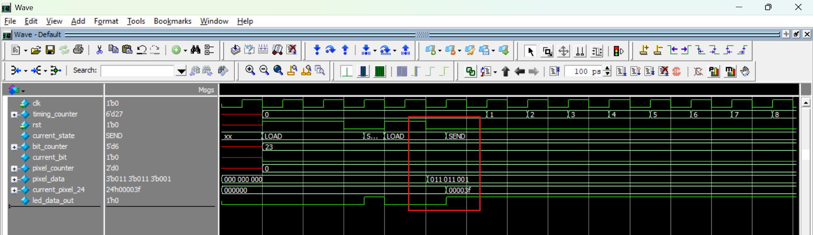

# 📝 Debug Log 1: Lỗi Lệch Chu Kỳ (Off-by-One) trong Khối Tick Generator

**Ngày ghi nhận:** 2026-08-31  
**Module:** `tick_generator.sv`  
**Mức độ (Severity):** Critical (Sai lệch định thời hệ thống)

## 1. Hiện tượng lỗi (Symptom)
* Tốc độ di chuyển của đạn (`bullet_tick`) và rắn (`snake_tick`) chạy chậm hơn một chút so với tính toán lý thuyết.
* Chu kỳ kích hoạt thực tế của mỗi xung nhịp bị kéo dài thêm đúng 1 chu kỳ xung nhịp (20 ns) trong mỗi chu kỳ lặp.

## 2. Nguyên nhân gốc rễ (Root Cause)
* Cả hai bộ đếm tạo xung nhịp đều được thiết kế bắt đầu đếm từ giá trị `0` (0-based counters).
* Khi cần đếm đủ `N` chu kỳ, chuỗi đếm hợp lệ sẽ gồm các phần tử: `0, 1, 2, ..., N-1` (tổng cộng chứa đúng `N` giá trị).
* Mã nguồn ban đầu kiểm tra điều kiện kết thúc bằng chính giá trị tổng số chu kỳ:
  ```systemverilog
  if (bullet_counter == BULLET_CYCLES)
  ```
và

```Systemverilog
if (snake_tick_count == SNAKE_TICKS_COUNT)
```
* Do so sánh với N thay vì N - 1, bộ đếm đã duyệt qua N + 1 giá trị (0 đến N), dẫn đến việc chu kỳ đếm bị dư ra 1 chu kỳ xung nhịp.  

## 3. Cách khắc phục (Resolution)
* Cập nhật điều kiện so sánh bằng cách trừ đi 1 khỏi tổng số chu kỳ mục tiêu:  
```Systemverilog
if (bullet_counter == BULLET_CYCLES - 1)
```
và:
```Systemverilog
if (snake_tick_count == SNAKE_TICKS_COUNT - 1)
```
## 4. Cấu hình Định thời Thực tế (Timing Configuration)
* Với xung nhịp hệ thống ngõ vào (Master Clock) là 50 MHz, chu kỳ xung nhịp $T_{clk} = \frac{1}{50\text{ MHz}} = \mathbf{20\text{ ns}}$.  

| Tín hiệu | Thời lượng mục tiêu | Phép tính | Giá trị đếm dừng |
|---|---:|---:|---:|
| `bullet_tick` | 50 ms | `50 ms / 20 ns` | `2,499,999` (đủ `2,500,000` cycles) |
| `snake_tick` | 250 ms | `5 × bullet_tick` | `4` (đủ `5` ticks) |

## 5. Bài học kinh nghiệm (Takeaway)
* Quy tắc bộ đếm 0-based: Luôn đặt điều kiện dừng là N - 1 khi cần đếm đúng N chu kỳ xung nhịp.

* Thói quen này giúp ngăn ngừa hoàn toàn lỗi lệch 1 nhịp (Off-by-One error) trong toàn bộ các khối định thời (Timer, Prescaler, Baud Rate Generator) trên FPGA.
---
<br>
<br>

# 📝 DEBUG LOG 2: WS2812B Driver

## 1. Các quyết định thiết kế chính

- `ws2812b_driver` nằm giữa `game_engine` và dải LED WS2812B.
  - Game Engine quyết định **mỗi LED nên có màu gì**.
  - Driver xử lý **việc tuần tự hóa dữ liệu (serialization) và tạo dạng sóng vật lý**.

- Tách biệt mã màu logic với định dạng WS2812B:

  `Mã màu logic 3-bit → 24-bit GRB → Dữ liệu nối tiếp gửi MSB trước`.

- Chụp một bản sao `tx_frame` trước khi truyền.
  Điều này ngăn việc `pixel_data` thay đổi trong trạng thái `SEND` làm trộn lẫn hai khung hình game.

- Sử dụng FSM đơn giản:
  `LOAD → SEND → LATCH → LOAD`
  - `LOAD`: Chụp một khung hình mới.
  - `SEND`: Tuần tự hóa pixel và bit trong khi tạo dạng sóng.
  - `LATCH`: Giữ đầu ra ở mức THẤP (LOW) trước khung hình tiếp theo.

- Sử dụng trực tiếp xung nhịp chính 50 MHz.
  Định thời được tạo bằng các bộ đếm; không cần xung nhịp chia (derived clock).

## 2. Các bài học Debug quan trọng

1. **Hoàn thành bit hiện tại trước khi chuyển tiếp**
   Không thay đổi trạng thái bit/pixel cho đến khi dạng sóng hiện tại hoàn thành đầy đủ.

3. **Xử lý rõ ràng bit/pixel cuối cùng**
   Sau bit cuối cùng của pixel cuối cùng, chuyển sang `LATCH` thay vì để các bộ đếm chạy vượt quá phạm vi hợp lệ.

4. **Logic đầu ra phải tuân theo trạng thái FSM**
   Trong trạng thái `LATCH`, `led_data_out` phải luôn ở mức THẤP (LOW) bất kể bit dữ liệu hiện tại là gì.

5. **Giữ ổn định khung hình đang truyền**
   `tx_frame` giữ nguyên không đổi trong suốt quá trình `SEND`; `pixel_data` mới cập nhật chỉ được chụp cho khung hình kế tiếp.

## 3. Mô hình datapath

```text
pixel_data
    ↓
  LOAD
    ↓
 tx_frame
    ↓
  SEND
    ├─ pixel hiện tại
    ├─ bit hiện tại
    └─ định thời dạng sóng
    ↓
  LATCH
    ↓
  LOAD lại
```

Khuôn mẫu RTL chính:

**FSM + bộ đếm + bộ tuần tự hóa + định thời đầu ra**

---
<br>
<br>

# 📝 Debug Log 3: Literal Size Mismatch trong khối Button Conditioner

**Ngày ghi nhận:** 2026-09-01

**Module:** `button_conditioner.sv`

**Mức độ (Severity):** Critical (Sai logic hệ thống ngay từ lúc khởi động)

## 1. Hiện tượng lỗi (Symptom)
Ngay sau khi hệ thống được cấp xung reset, board mạch tự động ghi nhận có thao tác nhấn phím liên tục từ `KEY[3]`, `KEY[2]`, và `KEY[1]`. Trong ngữ cảnh của game, điều này dẫn đến việc đạn tự động bắn ra liên tục hoặc hệ thống nhận các tín hiệu điều khiển sai lệch dù người dùng không hề thao tác vật lý trên kit DE2.

## 2. Nguyên nhân gốc rễ (Root Cause)
Các nút bấm vật lý trên kit DE2 được thiết kế theo cấu hình tích cực mức thấp (active-low). Điều này có nghĩa là khi nút đang ở trạng thái nhả (idle), tín hiệu ngõ vào phải là mức logic `1`.
Trong khối `always_ff` đồng bộ reset, giá trị khởi tạo được viết như sau:
```systemverilog
if(rst) begin
    sync_ff1   <= 1;
    sync_ff2   <= 1;
    prev_sync  <= 1;
end
```
Trong Verilog/SystemVerilog, hằng số `1` không khai báo kích thước sẽ được trình tổng hợp (Synthesizer) hiểu ngầm là số nguyên thập phân 32-bit (`32'd1` hoặc `32'b0000...0001`).

Khi hệ thống ép kiểu giá trị 32-bit này vào các thanh ghi 4-bit (`sync_ff1`, `sync_ff2`, `prev_sync`), nó tự động cắt lấy 4 bit LSB (Least Significant Bits), kết quả trở thành `4'b0001`.
Việc này vô tình đặt bit 3, 2 và 1 xuống mức logic `0`. Do đặc tính active-low, mạch edge detector ngay lập tức diễn dịch các mức `0` này thành sự kiện nút bấm hợp lệ, gây ra hiện tượng nhấn phím ảo.


## 3. Cách khắc phục (Resolution)
Thay thế số nguyên `1` bằng hằng số có kích thước tường minh (explicit size) `4'b1111` hoặc sử dụng toán tử điền đầy toàn bit (fill literal) `'1` đặc trưng của SystemVerilog để đảm bảo cả 4 bit đều được kéo lên mức `1` khi reset.

Mã nguồn sau khi sửa:

```systemverilog
always_ff @(posedge clk or posedge rst) begin
    if(rst) begin
        sync_ff1  <= '1; // Tương đương 4'b1111
        sync_ff2  <= '1;
        prev_sync <= '1;
    end
    else begin
        sync_ff1  <= key;
        sync_ff2  <= sync_ff1;
        prev_sync <= sync_ff2;
    end
end
```
## 4. Bài học kinh nghiệm (Takeaway)
Luôn định nghĩa rõ ràng kích thước của hằng số (bit-width) khi gán giá trị cho các thanh ghi đa bit (multi-bit registers) trong thiết kế RTL để tránh các hành vi cắt bit (truncation) không mong muốn từ công cụ tổng hợp mạch.


---
<br>
<br>

# 📝 Debug Log 4: Game Engine - Hành trình phát triển

## 1. Ý tưởng tổng thể

Game Engine là phần trung tâm của game: quản lý state, snake, bullet, collision và tạo `pixel_data` cho LED.

Tư duy chính:

```text
button_event + game ticks
           ↓
      Game Engine
      ├── FSM
      ├── Snake
      ├── Bullet
      ├── Collision
      └── Pixel rendering
```

Game Engine chỉ xử lý **logic game**, không xử lý debounce nút hay waveform WS2812B.

---

## 2. Chọn cách biểu diễn Snake

Snake được biểu diễn bằng một mảng 60 phần tử:

```text
snake_array[0:59]
```

Mỗi phần tử lưu một mã màu 3-bit.

Ngoài mảng, giữ thêm:
- `snake_length`: số segment còn lại.
- `head_position`: vị trí head hiện tại.

Reset bắt đầu với 5 segment ở cuối dải LED.

### Quyết định quan trọng

Thay vì dùng head/tail pointer và tính vị trí từng segment, ta chọn **shift toàn bộ `snake_array` mỗi `snake_tick`**.

Lý do: game chỉ có 60 LED và snake di chuyển khá chậm, nên cách này đơn giản, dễ kiểm tra waveform và đủ tốt cho project.

---

## 3. Biểu diễn Bullet

Chỉ cho phép **một bullet active tại một thời điểm**.

Bullet được quản lý bằng:
- `bullet_position`
- `bullet_color`
- `bullet_active`

Khi bắn:
- bullet bắt đầu tại LED 0.
- màu phụ thuộc vào button.
- bullet chỉ bắt đầu di chuyển ở các `bullet_tick` tiếp theo.

---

## 4. FSM của Game

Game Engine có 4 state:

```text
IDLE → PLAYING → WIN
              └→ LOSE
```

- `IDLE`: chờ người chơi bắt đầu.
- `PLAYING`: snake/bullet hoạt động.
- `WIN`: đã diệt hết snake segment.
- `LOSE`: snake chạm LED 0.

Note: **button đầu tiên sau reset chỉ dùng để start game, không bắn bullet.**

---

## 5. Look-Ahead cho Movement + Collision

Đây là phần quan trọng nhất khi xây Game Engine.

Ban đầu dễ nghĩ theo kiểu:

```text
snake move
↓
bullet move
↓
check collision
```

Nhưng nếu `snake_tick` và `bullet_tick` xảy ra cùng lúc, thứ tự xử lý có thể làm kết quả phụ thuộc vào cách viết sequential logic.

Vì vậy ta dùng **look-ahead**:

```text
current state
     ↓
tính next_head / next_bullet / ...
     ↓
check collision trên vị trí dự kiến
     ↓
commit tất cả cùng một clock edge
```

Các biến `next_*` giúp tách rõ:
- trạng thái hiện tại
- trạng thái dự kiến
- thời điểm commit

Đây là pattern quan trọng để tránh xử lý movement/collision theo thứ tự giả tạo.

---

## 6. Collision

Bullet đi từ LED 0 về phía snake head.

Vì bullet luôn gặp **head segment trước**, collision chỉ cần xét với head thay vì quét toàn bộ snake.

Khi collision:
- bullet inactive.
- So sánh màu bullet với màu segment bị gặp.
- **Cùng màu:** segment bị loại, `snake_length` giảm 1.
- **Khác màu:** snake không đổi.

Sau hit, head được chuyển sang segment kế tiếp trong snake.

---

## 7. Fire / Bullet Lifetime

Button event chỉ tạo bullet khi hiện tại **không có bullet active**.

Flow:

```text
button event
    ↓
no active bullet?
    ↓ yes
bullet_position = 0
bullet_color = selected color
bullet_active = 1
```

Nếu bullet:
- gặp snake → bị deactivate.
- đi tới cuối dải mà không collision → bị deactivate. (đặt điều kiện để bảo vệ khỏi out-of-bounds)

Một button event xảy ra cùng lúc bullet đang được xử lý không tự động tạo bullet mới trong cùng update.

---

## 8. WIN / LOSE

Hai điều kiện cuối game:

```text
snake_length == 0  → WIN
head_position == 0 → LOSE
```

WIN có priority cao hơn khi cả hai điều kiện cùng xuất hiện.

Khi vào terminal state:
- gameplay dừng.
- bullet không còn được hiển thị.
- toàn bộ LED được render theo màu terminal.

---

## 9. Pixel Rendering

`pixel_data` là output logic cho WS2812B driver.

Trong gameplay:

```text
snake_array
     ↓
bullet overlay
     ↓
pixel_data
```

Bullet được render **đè lên** snake tại vị trí của nó.

Điểm quan trọng:

> `pixel_data` chỉ là hình ảnh hiển thị.
> Collision phải kiểm tra state thật của snake, không dùng pixel overlay để quyết định hit.

Ở `WIN` và `LOSE`, toàn bộ 60 LED được render thành một màu terminal.

---

## 10. Những vấn đề / bài học chính khi xây Game Engine

### 10.1. Phân biệt current state và next state
- Không nên vừa cập nhật register vừa dùng giá trị mới ngay trong cùng clock.

### 10.2. Movement + collision cần nhìn cùng một thời điểm
- Đây là lý do xuất hiện look-ahead datapath.

### 10.3. Snake array và `head_position` phải nhất quán
- Khi snake bị hit hoặc shift, vị trí head phải khớp với segment thật trong array.

### 10.4. Không để firing ghi đè lên collision resolution
- Collision/end-of-bullet phải được xử lý trước khi xét tạo bullet mới.

### 10.5. Rendering khác với game state
- Bullet có thể che snake trên LED, nhưng không có nghĩa snake state đã thay đổi.

---

## 11. Mental Model cuối cùng

```text
             button_event
                  │
                  ▼
        ┌──────────────────┐
ticks → │    GAME ENGINE   │
        │                  │
        │ FSM              │
        │ Snake            │
        │ Bullet           │
        │ Look-ahead       │
        │ Collision        │
        │ Win / Lose       │
        │                  │
        └────────┬─────────┘
                 │
            pixel_data
                 │
                 ▼
          WS2812B Driver
```

Pattern tổng quát:

**Input → current state → calculate next state → resolve interactions → commit → render**


# Debug Log 5: Lỗi Lệch Dữ liệu trong WS2812B Driver


* **Module:** `ws2812b_driver` / `ws2812b_driver_tb`
* **Target Signal:** `current_pixel_24[23:0]`
* **Test Case Affected:** TC02 (TX Frame Capturing & Pixel Serialization)
* **Severity:** High (Simulation Data Flow Blocked)

---

### 1. Symptom & Waveform Observation
Trong quá trình chạy mô phỏng cho Test Case 2, tín hiệu mảng `pixel_data` đã được nạp dữ liệu ngẫu nhiên từ testbench và FSM đã chuyển trạng thái từ `LOAD` sang `SEND`. Tuy nhiên, trên cửa sổ Waveform của ModelSim, bus dữ liệu giải mã `current_pixel_24` liên tục bị ghim cố định ở giá trị mặc định:

```text
current_pixel_24 = 24'h00_00_00 (Color: OFF)
```
Mặc dù `pixel_counter = 0` và `tx_frame[0]` ghi nhận có bit bật, dữ liệu màu 24-bit GRB vẫn không chuyển sang bất kỳ giá trị màu nào (RED, GREEN, BLUE, YELLOW).

### 2. Root Cause Analysis
Nguyên nhân xuất phát từ việc tạo kích thích kiểm thử (stimulus generation) không có ràng buộc trong Testbench:

#### 2.1 Testbench Code gốc:
```systemverilog
for (int i = TEST_LEDS-1; i >= 0; i--) begin
    pixel_data[i] = $urandom; // Không giới hạn miền giá trị
end
```

#### 2.2 **Cơ chế lỗi:**
   * Hàm `$urandom` trả về một số nguyên 32-bit không dấu ngẫu nhiên. Khi gán vào biến 3-bit `pixel_data[i]`, giá trị bị cắt lấy 3 bit thấp, sinh ra các giá trị từ `0` đến `7`.
   * Đối chiếu với khối giải mã tổ hợp của RTL (`ws2812b_driver.sv`):
     ```systemverilog
     always_comb begin
         case (tx_frame[pixel_counter])
             3'b001:  current_pixel_24 = 24'h00_3F_00; // RED
             3'b010:  current_pixel_24 = 24'h3F_00_00; // GREEN
             3'b011:  current_pixel_24 = 24'h00_00_3F; // BLUE
             3'b100:  current_pixel_24 = 24'h3F_3F_00; // YELLOW
             default: current_pixel_24 = 24'h00_00_00; // OFF
         endcase
         current_bit = current_pixel_24[bit_counter];
     end
     ```
   * Khi `$urandom` rơi vào các mã `0` (`3'b000`), `5` (`3'b101`), `6` (`3'b110`), hoặc `7` (`3'b111`), khối `case` không khớp bất kỳ điều kiện màu hợp lệ nào và luôn rơi vào nhánh `default`.

   * Xác suất rơi vào mã không hợp lệ lên tới 50%. Nếu testbench sinh trúng các giá trị này, `current_pixel_24` sẽ luôn bằng `0`, tạo cảm giác hệ thống bị treo hoặc không cập nhật từ `tx_frame`.

---

### 3. Resolution & Fix Implementation
Áp dụng cơ chế **Constrained-Random Stimulus** bằng cách giới hạn chặt miền giá trị ngẫu nhiên trong Testbench thông qua hàm `$urandom_range`:

```systemverilog
// File: ws2812b_driver_tb.sv
task automatic capturing_txframe();
    // ...
    for(int i = TEST_LEDS-1; i >= 0; i--) begin
        pixel_data[i] = $urandom_range(4, 0);
    end
    // ...
endtask
```

---

### 4. Verification & Waveform Evidence
Sau khi cập nhật hàm sinh kích thích:

* **Console Output:**
  ```text
  TEST CASE 2: TX FRAME CAPTURING
  Time = 70001 ps | State = SEND
  pixel_data[0] = 010 (GREEN) | tx_frame[0] = 010
  pixel_data[1] = 001 (RED)   | tx_frame[1] = 001
  pixel_data[2] = 011 (BLUE)  | tx_frame[2] = 011
  ```
* **Dạng sóng Waveform:** 
  
  * Ngay tại chu kỳ clock đầu tiên của trạng thái `SEND`, `current_pixel_24` lập tức cập nhật giá trị `24'h3F_00_00` tương ứng với mã màu `GREEN` của `tx_frame[0]`.

---

### 5. Lessons Learned
* **Testbench Stimulus Constraint:** Không bao giờ gán trực tiếp dữ liệu ngẫu nhiên không ràng buộc (`$urandom`) vào các bus điều khiển hoặc bus dữ liệu có tập giá trị hợp lệ hữu hạn.
* **Debugging Protocol:** Khi một bus tổ hợp ngõ ra không đổi giá trị, cần kiểm tra nhánh `default` của khối `case` trước tiên để xác định xem đầu vào có đang nhận giá trị ngoài bảng mã hay không.